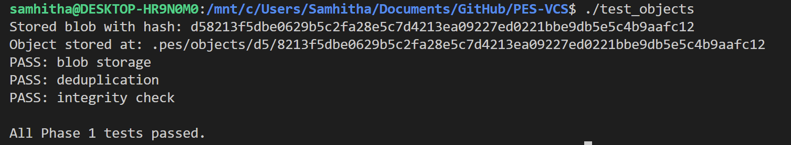
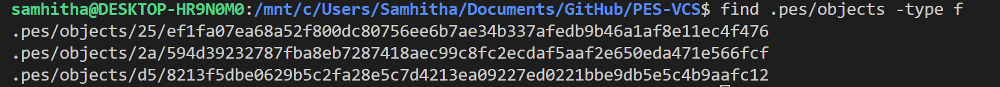
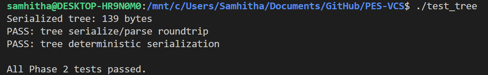
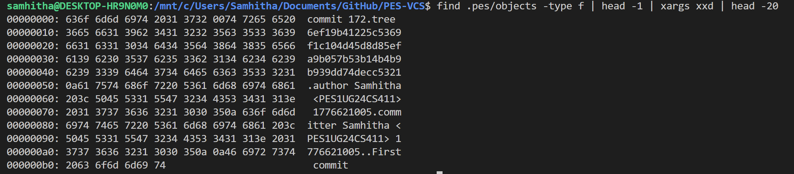
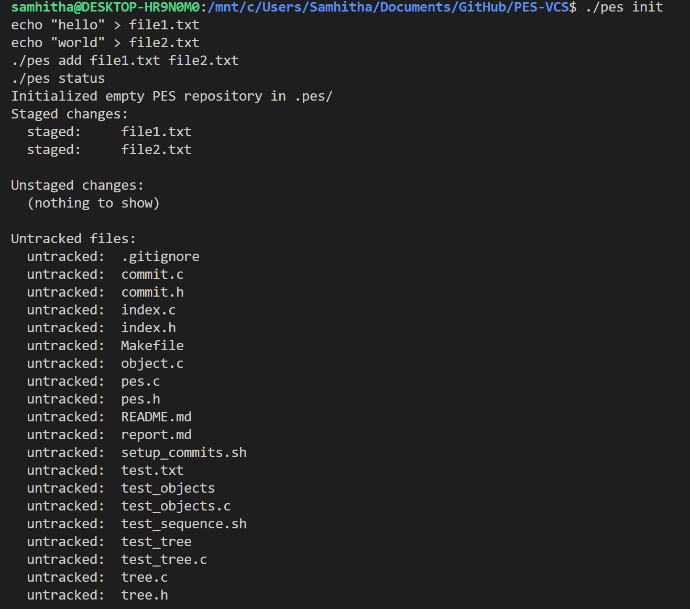
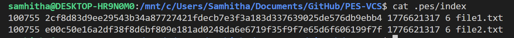
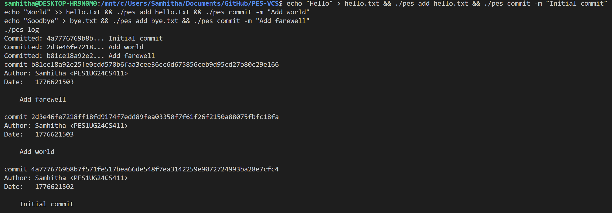
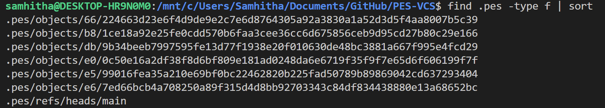
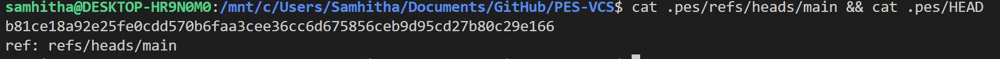
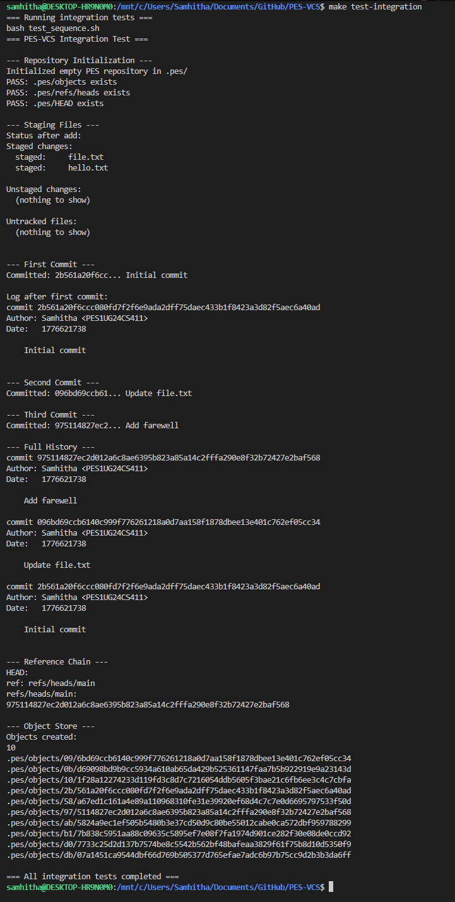

# PES-VCS Lab Report

**Name:** Samhitha  
**Platform:** Ubuntu 22.04  
**Repository:** PES-VCS — A Version Control System from Scratch

---

## Table of Contents

1. [Phase 1: Object Storage — Screenshots](#phase-1-object-storage-screenshots)
2. [Phase 2: Tree Objects — Screenshots](#phase-2-tree-objects-screenshots)
3. [Phase 3: Index (Staging Area) — Screenshots](#phase-3-index-staging-area-screenshots)
4. [Phase 4: Commits and History — Screenshots](#phase-4-commits-and-history-screenshots)
5. [Final Integration Test](#final-integration-test)
6. [Phase 5: Branching and Checkout (Analysis)](#phase-5-branching-and-checkout-analysis)
7. [Phase 6: Garbage Collection (Analysis)](#phase-6-garbage-collection-analysis)

---

## Phase 1: Object Storage — Screenshots

> **📸 Screenshot 1A:** `./test_objects` output showing all tests passing.



> **📸 Screenshot 1B:** `find .pes/objects -type f` showing the sharded directory structure.



---

## Phase 2: Tree Objects — Screenshots

> **📸 Screenshot 2A:** `./test_tree` output showing all tests passing.



> **📸 Screenshot 2B:** `xxd` of a raw tree object (first 20 lines).



---

## Phase 3: Index (Staging Area) — Screenshots

> **📸 Screenshot 3A:** `./pes init`, `./pes add file1.txt file2.txt`, `./pes status` sequence.



> **📸 Screenshot 3B:** `cat .pes/index` showing the text-format index with entries.



---

## Phase 4: Commits and History — Screenshots

> **📸 Screenshot 4A:** `./pes log` output showing three commits with hashes, authors, timestamps, and messages.



> **📸 Screenshot 4B:** `find .pes -type f | sort` showing object store growth after three commits.



> **📸 Screenshot 4C:** `cat .pes/refs/heads/main` and `cat .pes/HEAD` showing the reference chain.



---

## Final Integration Test

> **📸 Screenshot:** `make test-integration` output showing the full integration test passing.



---

## Phase 5: Branching and Checkout (Analysis)

### Q5.1 — How would you implement `pes checkout <branch>`?

**Files that need to change in `.pes/`:**

1. **`.pes/HEAD`** — Must be updated to `ref: refs/heads/<branch>` to point to the new branch.
2. **`.pes/refs/heads/<branch>`** — Must already exist (or be created) pointing to the target commit hash.
3. **`.pes/index`** — Must be rebuilt to match the tree snapshot of the target branch's latest commit.

**What must happen to the working directory:**

1. Read the target branch's tip commit hash from `.pes/refs/heads/<branch>`.
2. Load the commit object and extract its `tree` hash.
3. Walk the tree recursively, and for each blob entry, read the stored blob and **write it over the corresponding working-directory file**.
4. Files present in the working directory but **not** in the target tree must be **deleted** (if they were tracked in the current branch).
5. Re-populate `.pes/index` with entries from the target tree (paths, modes, hashes, and current mtime/size).

**What makes this operation complex:**

- **Conflict detection:** If the user has modifications to a tracked file that differs between branches, we must refuse to overwrite it (see Q5.2).
- **Partial failure:** If we've started overwriting files and then encounter an error, the working directory is in an inconsistent state. Git solves this by doing a full "safe-to-checkout" check before touching any files.
- **Untracked files:** Files that exist locally but aren't in any branch could be silently overwritten if the target branch has a file at the same path with different content.
- **Directory creation and deletion:** If the target branch adds subdirectories that don't exist yet, those directories must be `mkdir`-ed; similarly, directories that disappear after checkout must be removed (only if empty).

---

### Q5.2 — How would you detect a "dirty working directory" conflict using only the index and the object store?

**Algorithm:**

1. **Load the current index** from `.pes/index`.
2. For each entry in the current index:
   - `stat()` the file in the working directory.
   - If `st.st_mtime != index_entry.mtime_sec` OR `st.st_size != index_entry.size`, the file may have changed.
   - To confirm the change (not just a metadata artifact), **re-hash the file** with SHA-256 and compare to `index_entry.hash`.
   - If the hash differs → the file is **dirty** (modified in the working directory but not staged).
3. **Check the target branch's tree** for any file that the user has dirtied:
   - Read the target commit → tree → walk files.
   - If the target tree has a different blob hash for the same path than our current index has → the file is going to change during checkout.
4. If a file is both **dirty in the working directory** AND **different in the target branch** → refuse the checkout and print an error like `"error: Your local changes to '<file>' would be overwritten by checkout."`.

**Why only index + object store is sufficient:**

- The index records the last-known-clean state of every tracked file (hash, mtime, size).
- The object store holds every version's content.
- We never need to walk the filesystem beyond stat()-ing indexed files and reading changed ones.

---

### Q5.3 — What is "Detached HEAD" and how do you recover commits made in that state?

**What "Detached HEAD" means:**

Normally, `.pes/HEAD` contains a symbolic reference like `ref: refs/heads/main`. In detached HEAD mode, `.pes/HEAD` directly contains a raw commit hash (e.g., `a1b2c3d4...`). This happens when you check out a specific commit rather than a branch name.

**What happens if you make commits in this state:**

New commits are created and written to the object store normally. `head_update()` sees that HEAD is not a symbolic ref, so it writes the new commit hash directly into HEAD. The commits form a valid chain in the object store, but **no branch pointer refers to them**. If you then check out a branch, HEAD no longer points to these commits, and they become "unreachable" — not referenced by any branch ref.

**How a user can recover those commits:**

1. **Before switching away**, note the hash that HEAD contains (e.g., `cat .pes/HEAD` → `a1b2c3...`).
2. Create a new branch at that commit:
   ```
   echo "a1b2c3..." > .pes/refs/heads/recovery-branch
   ```
   Then update HEAD: `echo "ref: refs/heads/recovery-branch" > .pes/HEAD`.
3. If the user already switched away and lost track of the hash, they can search the object store for commit objects and trace the chain manually (equivalent to `git reflog`).
4. In real Git, `git reflog` keeps a log of every HEAD movement. A similar log file at `.pes/logs/HEAD` would record every hash HEAD ever pointed to, making recovery trivial.

---

## Phase 6: Garbage Collection (Analysis)

### Q6.1 — Algorithm to find and delete unreachable objects

**Algorithm (Mark and Sweep):**

**Mark phase — find all reachable objects:**
1. Start from all branch tips: read every file in `.pes/refs/heads/` to get root commit hashes.
2. For each starting commit hash, do a BFS/DFS walk:
   - Add the commit hash to the **reachable set** (a hash set).
   - Parse the commit object → extract `tree` hash and `parent` hash.
   - If `tree` hash is not already in the reachable set, add it and recursively walk the tree:
     - For each tree entry: if it's a blob → add its hash; if it's a subtree → recurse.
   - If `parent` exists and not already visited, recurse into it.
3. Continue until all reachable commits, trees, and blobs have been added to the reachable set.

**Sweep phase — delete unreachable objects:**
1. Walk every file under `.pes/objects/XX/YYYY...` (using `find` or `opendir`/`readdir`).
2. Reconstruct each object's full hash from its path (first 2 chars + rest of filename).
3. If the hash is **not** in the reachable set → delete the file with `unlink()`.
4. After deleting objects, remove any now-empty shard directories with `rmdir()`.

**Data structure for efficiency:**
- A **hash table** (open addressing or chaining) keyed by the 32-byte ObjectID. Each lookup/insert is O(1).
- Alternatively, a **bit array** indexed by hash prefix (works well for a known maximum number of objects).

**Estimate for 100,000 commits, 50 branches:**
- Assume each commit creates on average 2 new unique tree objects and 5 new blobs = ~7 new objects per commit.
- Total objects ≈ 100,000 × 7 = **~700,000 objects** need to be visited in the mark phase.
- The sweep phase visits every object in `.pes/objects/` (same ~700,000).
- Total visits ≈ 1.4 million object lookups — O(N) in the number of objects, very manageable.

---

### Q6.2 — Race condition between GC and a concurrent commit

**Race condition scenario:**

| Time | GC Process | Commit Process |
|------|-----------|----------------|
| T1 | Begins mark phase, scans all branch refs | — |
| T2 | Finishes marking: set = {C2, C1, tree1, blob1, ...} | — |
| T3 | — | `object_write` writes new blob `blob_new` to the object store |
| T4 | — | `object_write` writes new tree `tree_new` pointing to `blob_new` |
| T5 | Begins sweep phase, scans all objects in `.pes/objects/` | — |
| T6 | Finds `blob_new` — **not in reachable set** → deletes it! | — |
| T7 | — | `object_write` writes new commit `commit_new` pointing to `tree_new` |
| T8 | — | `head_update` moves branch pointer to `commit_new` |
| T9 | — | User runs `pes log` → tries to read `blob_new` → **MISSING → corruption!** |

**Why it's dangerous:**

The GC's mark phase captured the reachable set **before** the commit wrote `blob_new`. During the sweep phase, `blob_new` exists in the object store but is not in the reachable set, so GC deletes it. The commit then finishes and HEAD points to a commit whose tree references a now-deleted blob. The repository is **corrupted**.

**How Git's real GC avoids this:**

1. **Grace period / timestamp filter:** Git's `git gc` skips any object file newer than a configurable threshold (default: 2 weeks for `gc.pruneExpire`, but for "loose" objects during normal GC, objects newer than the "recent" cutoff are kept). A new blob written during GC's mark phase will have a recent mtime and will not be swept.

2. **Lock files:** Git uses lock files (`.git/gc.pid`, `.git/index.lock`) to prevent concurrent GC runs and to signal that a GC is in progress. Commit operations check for these locks.

3. **Two-phase deletion:** Instead of immediately `unlink()`-ing objects, Git's GC first moves them to a "quarantine" pack, giving in-flight operations time to complete their writes and update refs before the objects are truly gone.

4. **Ref-based safety:** Because a commit is not reachable until `head_update()` atomically moves the branch pointer, any object written before that point is not yet in the reachable set — but Git's "recent object" grace period ensures they won't be deleted before the commit finishes and the ref is updated.
